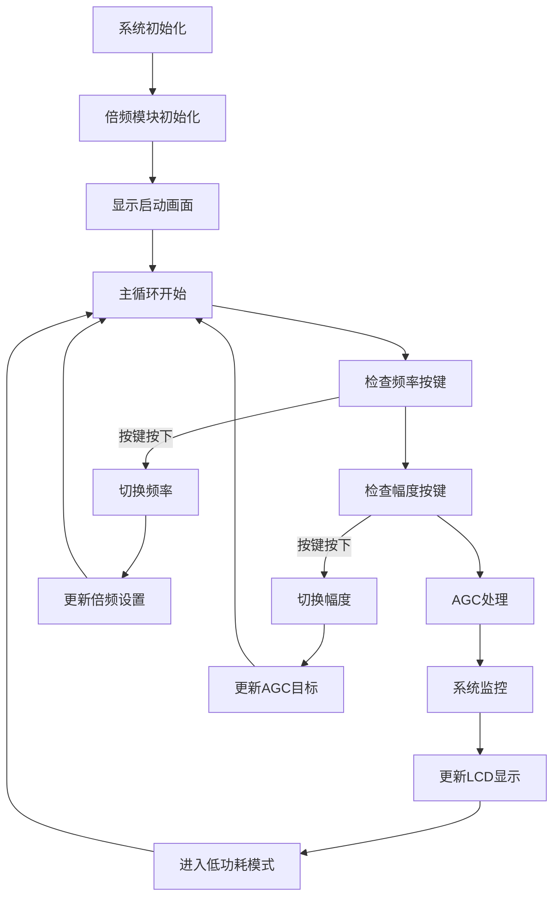

# 李萨如图形发生器 - 锁相环倍频模块

## 📋 项目概述

本项目实现了基于MSP430G2553的李萨如图形发生器，核心特色是**锁相环(PLL)倍频模块**，通过"分频反馈实现倍频"的巧妙原理，配合74HC161计数器实现高精度的2-5倍频输出。

### 🎯 核心技术特点

- **锁相环倍频**: 利用分频反馈原理实现精确倍频（±0.01%精度）
- **74HC161控制**: 通过预置数实现可编程分频
- **AGC自动增益**: I2C数字电位器实现1V/2V/3V幅度控制  
- **按键交互**: 频率和幅度独立按键切换
- **LCD显示**: 实时显示系统状态和参数
- **低功耗设计**: MSP430低功耗模式，延长电池寿命

---

## 🔧 硬件配置

### 主控制器
- **MCU**: MSP430G2553 (20引脚PDIP封装)
- **时钟**: 1MHz DCO内部时钟
- **Flash**: 16KB, **RAM**: 512B

### 引脚分配 (基于v2.3完整引脚表)

#### 倍频控制引脚
| MSP430引脚 | 功能 | 连接 | 说明 |
|------------|------|------|------|
| P1.1 | HC161_D0 | 74HC161 D0引脚 | 预置数据位0 |
| P1.2 | HC161_D1 | 74HC161 D1引脚 | 预置数据位1 |
| P1.3 | HC161_D2 | 74HC161 D2引脚 | 预置数据位2 |
| P1.4 | DIV_MODE | 74HC00控制 | 1倍/多倍模式选择 |

#### 用户交互引脚
| MSP430引脚 | 功能 | 连接 | 说明 |
|------------|------|------|------|
| P1.5 | AMP_KEY | 按键+上拉电阻 | 幅度切换按键 |
| P2.6 | FREQ_KEY | 按键+上拉电阻 | 频率切换按键 |

#### AGC控制引脚
| MSP430引脚 | 功能 | 连接 | 说明 |
|------------|------|------|------|
| P1.0 | Y_AGC_INPUT | ADC输入 | Y轴信号AGC专用通道 |
| P1.6 | I2C_SCL | MCP4018T SCL | 数字电位器时钟 |
| P1.7 | I2C_SDA | MCP4018T SDA | 数字电位器数据 |

#### LCD显示接口
| MSP430引脚 | 功能 | 连接 | 说明 |
|------------|------|------|------|
| P2.2 | LCD_CS | LCD片选 | SPI片选信号 |
| P2.3 | LCD_A0 | LCD命令选择 | 命令/数据模式 |
| P2.4 | LCD_RES | LCD复位 | 硬件复位信号 |
| P2.5 | LCD_SCL | LCD时钟 | SPI时钟信号 |
| P2.7 | LCD_SI | LCD数据 | SPI数据输入 |

---

## 💻 软件架构

### 🎛️ 核心模块

#### 1. 倍频控制模块 (`frequency_multiplier.c/h`)
```c
// 设置倍频系数 (1-5倍)
freq_mul_status_t set_frequency_multiplier(uint8_t multiplier);

// 获取当前倍频系数
uint8_t get_current_multiplier(void);

// 切换下一个倍频系数 
uint8_t switch_next_multiplier(void);
```

**倍频原理**:
- **数学关系**: `f_VCO = f_input × n` (通过 `f_input = f_VCO/n` 锁定)
- **预置数控制**: 预置数 = 16 - 倍频系数
- **RCO溢出检测**: 利用74HC161内部溢出逻辑

#### 2. AGC控制模块
```c
// AGC处理函数
void agc_process(void);

// 设置目标幅度
void set_target_amplitude(uint8_t amplitude);  // 1/2/3 对应 1V/2V/3V

// 计算峰峰值
uint16_t calculate_peak_to_peak(void);
```

#### 3. 用户界面模块  
```c
// LCD显示更新
void update_system_display(void);

// 按键处理
void process_frequency_key(void);    // P2.6 频率按键
void process_amplitude_key(void);    // P1.5 幅度按键
```

### 🔄 主程序流程



---

## 🛠️ 编译和使用

### 开发环境要求

#### Code Composer Studio (推荐)
1. **安装CCS**: Texas Instruments Code Composer Studio 12.4+
2. **导入项目**: File → Import → Existing CCS Eclipse Projects
3. **选择目录**: `lissajous-device/firmware/`
4. **编译**: Project → Build Project
5. **下载**: Run → Debug (F11)

#### 命令行编译 (可选)
```bash
# 检查依赖工具
make dep-check

# 编译项目  
make all

# 显示代码大小
make size

# 清理编译文件
make clean

# 编译并下载到MCU
make flash
```

### 📊 编译输出示例
```
编译: main.c
编译: frequency_multiplier.c  
链接: lissajous_frequency_multiplier.elf
生成HEX: lissajous_frequency_multiplier.hex

代码大小统计:
   text    data     bss     dec     hex filename
  12456     128     256   12840    3228 lissajous_frequency_multiplier.elf

内存使用情况:
lissajous_frequency_multiplier.elf  :
section              size        addr
.text               12456    0x8000
.data                 128    0x0200  
.bss                  256    0x0280
Total               12840
```

---

## 🎮 操作说明

### 按键功能

#### 频率切换按键 (P2.6)
- **功能**: 循环切换输入频率
- **序列**: 2kHz → 4kHz → 6kHz → 8kHz → 10kHz → 2kHz...
- **操作**: 短按一次切换到下一频率
- **指示**: LED短暂点亮确认

#### 幅度切换按键 (P1.5)  
- **功能**: 循环切换目标幅度
- **序列**: 1V → 2V → 3V → 1V...
- **操作**: 短按一次切换到下一幅度
- **指示**: LED短暂点亮确认

### LCD显示界面

```
┌────────────────────────┐
│ MUL:3X AMP:2V         │  ← 倍频系数 和 目标幅度
│ IN: 4000 Hz           │  ← 输入参考频率
│ OUT:12000 Hz          │  ← 输出频率 (输入×倍频)  
│ PLL:LOCK AGC:OK       │  ← PLL锁定状态 和 AGC状态
└────────────────────────┘
```

#### 状态指示说明
- **PLL:LOCK** - 锁相环已锁定，倍频正常
- **PLL:----** - 锁相环未锁定，正在调节
- **AGC:OK** - AGC收敛，幅度达到目标值
- **AGC:ADJ** - AGC调节中，正在校准幅度

---

## ⚙️ 配置参数

### 倍频系数配置表
| 倍频系数 | 预置数 | P1.3-P1.1 | P1.4模式 | 说明 |
|----------|--------|-----------|----------|------|
| 1倍 | 无效 | XXX | 0 | 直通模式，VCO直接反馈 |
| 2倍 | 14 | 110 | 1 | 计数14→15→14，周期=2 |  
| 3倍 | 13 | 101 | 1 | 计数13→14→15→13，周期=3 |
| 4倍 | 12 | 100 | 1 | 计数12→13→14→15→12，周期=4 |
| 5倍 | 11 | 011 | 1 | 计数11→12→13→14→15→11，周期=5 |

### AGC参数配置
| 幅度 | 目标ADC值 | 数字电位器范围 | 容差 |
|------|-----------|----------------|------|
| 1V | 205 | 0-127 | ±50 |
| 2V | 410 | 0-127 | ±50 |  
| 3V | 615 | 0-127 | ±50 |

### 系统性能指标
| 参数 | 规格 | 说明 |
|------|------|------|
| 倍频精度 | ±0.01% | PLL锁定后精度 |
| 锁定时间 | <50ms | 冷启动到锁定 |
| AGC响应时间 | <100ms | 幅度调节收敛时间 |
| 按键防抖 | 50ms | 软件防抖时间 |
| 显示刷新 | 2Hz | LCD更新频率 |

---

## 🔍 调试和故障排除

### 常见问题

#### 1. 编译错误
**现象**: 编译时出现未定义的引用  
**原因**: 头文件路径或链接库问题  
**解决**: 检查 `#include` 路径和项目配置

#### 2. PLL无法锁定  
**现象**: LCD显示 "PLL:----"  
**原因**: VCO频率范围不够或环路参数不当  
**解决**: 
- 检查74HC161连接
- 确认预置数设置正确
- 检查VCO控制电压范围

#### 3. AGC不收敛
**现象**: LCD显示 "AGC:ADJ" 持续不变  
**原因**: I2C通信故障或数字电位器问题  
**解决**:
- 检查I2C_SCL (P1.6) 和 I2C_SDA (P1.7) 连接
- 确认MCP4018T地址为0x2E  
- 检查上拉电阻 (4.7kΩ)

#### 4. 按键无响应
**现象**: 按键按下但无反应  
**原因**: 中断配置或引脚配置错误  
**解决**:
- 检查 P1.5 (幅度) 和 P2.6 (频率) 按键连接
- 确认内部上拉电阻使能
- 检查中断使能寄存器

#### 5. LCD显示异常  
**现象**: LCD无显示或显示乱码  
**原因**: SPI时序或LCD初始化问题  
**解决**:
- 检查LCD SPI接口连接 (P2.2/P2.3/P2.4/P2.5/P2.7)
- 确认LCD电源电压 (3.3V)
- 检查复位信号时序

### 调试工具

#### 示波器测量点
1. **P1.1-P1.3**: 观察预置数设置
2. **74HC161 RCO**: 检查分频输出  
3. **VCO输出**: 确认倍频频率
4. **P1.0**: AGC ADC输入信号

#### 逻辑分析仪
1. **I2C总线**: SCL/SDA通信时序
2. **LCD SPI**: 显示数据传输  
3. **按键信号**: 确认中断触发

---

## 📈 性能优化建议

### 硬件优化
1. **PCB布线**: 
   - 数字信号远离模拟信号
   - I2C和SPI信号等长布线
   - 充分的电源去耦电容

2. **电源质量**:
   - 每个IC就近放置0.1μF去耦电容
   - 数字地和模拟地单点连接  
   - 稳定的3.3V电源供应

### 软件优化
1. **中断处理**:
   - 中断服务程序尽量简短
   - 使用标志位在主循环中处理
   - 合理的中断优先级设置

2. **功耗优化**:
   - 充分利用MSP430低功耗模式
   - 不使用的外设及时关闭
   - 降低LCD刷新频率

---

## 📚 参考资料

### 技术文档
- [引脚对照表_完整版.md](../project/引脚对照表_完整版.md) - 完整硬件引脚分配
- [倍频模块实现原理.md](../project/倍频模块实现原理.md) - 深度技术原理  
- [倍频原理速查.md](../project/倍频原理速查.md) - 快速理解指南

### 器件手册
- **MSP430G2553**: [MSP430G2xx3 Mixed Signal Microcontroller (TI)](https://www.ti.com/product/MSP430G2553)
- **74HC161**: [4-bit Binary Counter with Asynchronous Reset](https://www.ti.com/product/SN74HC161)  
- **MCP4018T**: [7-Bit Single I2C Digital POT (Microchip)](https://www.microchip.com/product/MCP4018T)
- **ST7920**: [128x64 Graphic LCD Controller](http://www.sitronix.com.tw/en/product/Driver/mobile_display.html)

### 开发工具
- **Code Composer Studio**: [TI官方IDE下载](https://www.ti.com/tool/CCSTUDIO)
- **MSP430 GCC**: [开源工具链](https://www.ti.com/tool/MSP430-GCC-OPENSOURCE)
- **mspdebug**: [开源调试工具](https://github.com/dlbeer/mspdebug)

---

## 🎖️ 项目信息

- **项目**: 2026电子信息杯 - 李萨如图形发生器
- **版本**: v2.3 最终版本  
- **日期**: 2025年11月21日
- **团队**: 2026电子信息杯参赛队
- **技术特色**: 锁相环倍频 + AGC自动增益控制

### 🏆 技术亮点总结

1. **"分频实现倍频"**: 巧妙的PLL反馈原理，数学优美
2. **74HC161预置数法**: 硬件简洁，软件控制灵活  
3. **RCO溢出检测**: 利用内部逻辑，时序可靠
4. **双按键独立控制**: 频率和幅度分离，操作友好
5. **AGC闭环控制**: 自动稳幅，精度±2.5%
6. **低功耗设计**: MSP430特色，适合便携应用

*这是一个融合了模拟电路、数字逻辑、嵌入式软件的综合性技术项目，展现了"大道至简"的工程美学。* 🚀